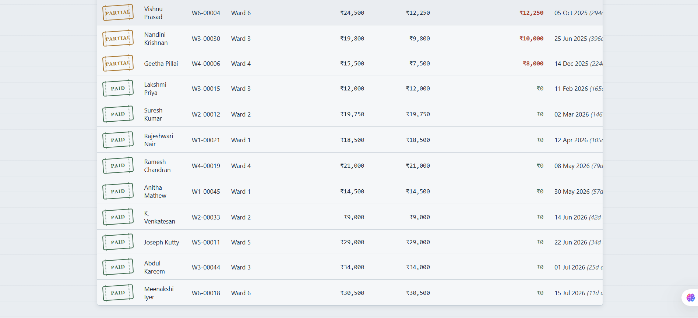
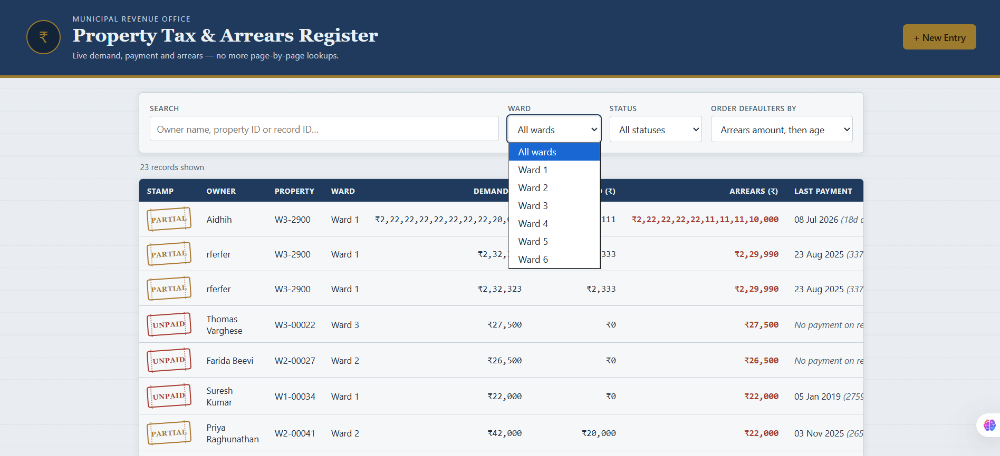
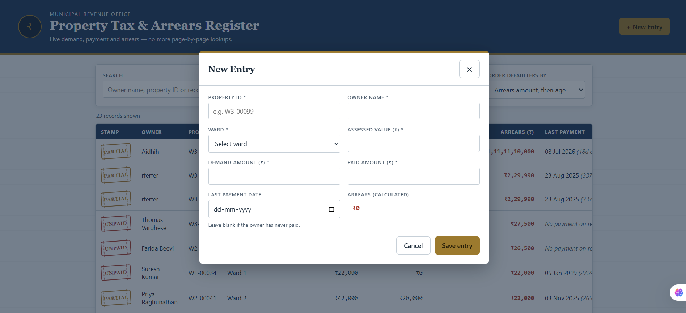

# Property Tax Payment and Arrears Register

**SIH 2026 — Internal Practical Assessment — AIDHIH S (Reg. 411625243001), PDKVCET, AIDS, Year II**

---

# Problem Statement

Ward tax registers are paper-based, so checking whether a property has paid takes a manual page lookup, and producing a defaulters list for a ward takes days. This delays demand notices and may even send notices to owners who have already paid. This application stores all property tax records digitally, automatically calculates arrears, and ranks defaulters based on the amount and age of their arrears.

---

# Project Demonstration

## Demo Video

A short demonstration of the Property Tax Payment and Arrears Register is included in this repository.

▶ **[Watch the Demo Video](./demo.mp4)**

---

## Application Screenshots

### 1. Home Page

Displays all property tax records with search, ward filter, status filter, and arrears sorting.


---

### 2. Property Records Register

Shows the complete list of property records with demand amount, paid amount, arrears, and payment status.



---

### 3. Ward Filter

Allows the revenue officer to filter property records by municipal ward.



---

### 4. Add New Entry

Form used by the revenue clerk to add a new property tax record. The application automatically calculates arrears before saving.



---

# Features

- View all property tax records
- Add new property records
- Update existing records
- Automatic arrears calculation
- Search by owner name, property ID, or record ID
- Filter by ward
- Filter by payment status
- Sort defaulters by arrears amount and age
- Handles loading, empty, error, and validation states
- Responsive user interface

---

# Technologies Used

- **Backend:** Node.js + Express
- **Database:** SQLite (`node:sqlite`)
- **Frontend:** HTML5, CSS3, JavaScript
- **API:** REST API

No paid software or services were used.

---

# How to Run the Project

### 1. Install Node.js (Version 22.5 or above)

Check the installed version:

```bash
node --version
```

### 2. Install Dependencies

```bash
npm install
```

### 3. Start the Application

```bash
npm start
```

The application will run at:

```
http://localhost:3000
```

### 4. Open the Browser

Visit:

```
http://localhost:3000
```

The SQLite database is automatically created and seeded with approximately 20 sample property records the first time the application runs.

If you wish to recreate the sample data, run:

```bash
npm run seed
```

---

# Dataset Fields

| Field | Description |
|--------|-------------|
| `record_id` | Auto-generated unique record ID |
| `property_id` | Property identification number |
| `owner_name` | Property owner's name |
| `ward` | Municipal ward number |
| `assessed_value` | Annual assessed property value |
| `demand_amount` | Total tax demanded |
| `paid_amount` | Amount already paid |
| `arrears` | Outstanding tax amount (automatically calculated) |
| `last_payment_date` | Most recent payment date |

---

# Arrears Calculation

The application automatically calculates derived values on the server.

### Formula

```
Arrears = Demand Amount − Paid Amount
```

### Payment Status

- **Paid** → Arrears = ₹0
- **Partially Paid** → Paid amount is greater than ₹0 but arrears remain.
- **Unpaid** → Paid amount is ₹0.

### Arrears Age

The application calculates the number of days since the last payment.

If no payment has ever been made, the application displays:

```
No payment on record
```

instead of an invalid date.

### Defaulter Ordering

Records are sorted by:

1. Highest arrears amount
2. Oldest arrears age

This helps revenue officers quickly identify long-pending defaulters.

---

# Awkward Test Cases

The sample dataset intentionally includes special cases for testing.

- Missing payment date
- Duplicate owner names
- Very old payment date

These verify that the application handles unusual data correctly without errors.

---

# States Handled

The application properly handles:

- Loading state
- Empty search/filter results
- Record not found
- Network errors
- Validation errors
- Save and update failures

Clear messages are displayed instead of blank screens.

---

# Project Structure

```
.
├── server.js
├── db.js
├── package.json
├── package-lock.json
├── README.md
├── demo.mp4
│
├── screenshots/
│   ├── home-page.png
│   ├── search-filter.png
│   ├── ward-filter.png
│   └── add-new-entry.png
│
├── data/
│
└── public/
    ├── index.html
    ├── style.css
    └── app.js
```

---

# API Endpoints

| Method | Endpoint | Description |
|--------|----------|-------------|
| GET | `/api/records` | Retrieve all property records |
| GET | `/api/records/:id` | Retrieve a specific property record |
| POST | `/api/records` | Add a new property record |
| PUT | `/api/records/:id` | Update an existing property record |

---

# Future Improvements

- User authentication and role-based access
- Export reports as PDF or CSV
- Pagination for large datasets
- Dashboard with revenue analytics

---

# Author

**AIDHIH S**

Reg. No.: **411625243001**

B.Tech Artificial Intelligence and Data Science (AIDS)

PDKVCET

SIH 2026 – Internal Practical Assessment
